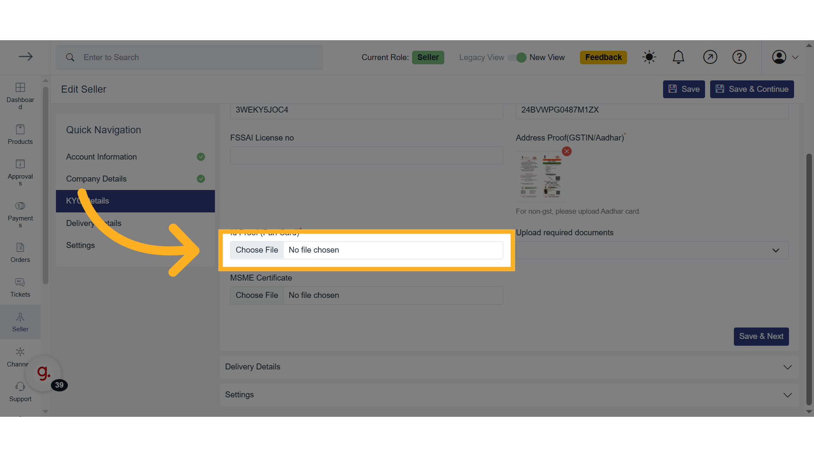
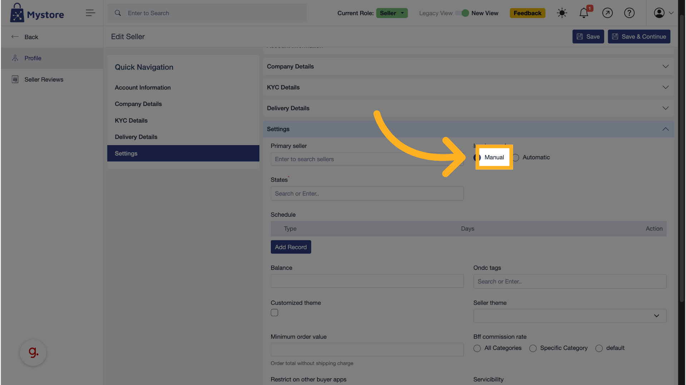

# Seller Onboarding and KYC

This page outlines the essential business setup information—Account, Company, KYC, Delivery, and Settings—that will be completed during the **Seller Onboarding and KYC** phase of the documentation.

## Account Information

### Enter First Name

Enter your first name as it appears on legal documents.

### Enter Last Name

Provide your surname or last name to complete your identification.

### Click "Save & Next"

Click this button to save the information and continue to the next section.

## Company Details

### Upload Logo

Upload a logo representing your brand. This helps customers recognize your store.

### Enter Legal Business Name

Input your business’s officially registered name for compliance purposes.

### Enter Business Description

Briefly describe your business—what you sell, your values, or target audience.

### Enter Your Website Address

Include your website URL if available, to enhance credibility and visibility.

### Enter Store Address

Type the full physical address where your business operates.

### Enter Store City

Mention the city in which your store is based.

### Enter State

Choose the correct state from the dropdown that matches your business location.

### Enter Pin Code

Provide the postal pin code for accurate location mapping.

### Fill Contact Email

Enter a valid email address to receive order updates and inquiries.

### Enter Contact Phone Number

Add a mobile or landline number customers or support can use to contact you.

### Enter Account Number

Provide your business bank account number for payment settlements.

### Fill IFSC Code

Input the IFSC code of your bank branch for transaction verification.

### Fill Account Holder Name

Enter the name of the account holder (must match bank records).

### Upload Cancelled Cheque

Upload a scanned copy of a canceled cheque for account verification.

### Click "Save & Next"

Click this button to save the information and continue to the next section.

## KYC Details

### Enter PAN Number

Enter your business or individual PAN number for tax and identity verification.

### Upload Address Proof (GSTIN/Aadhar)

Choose and upload either your GST certificate or Aadhar card as address proof.

### Upload PAN Card

Upload a copy of your PAN card for identification purposes.

### Select Appropriate Document Type

Select the document type you're uploading from the dropdown list.

### Upload Chosen Document

After selecting the document type, upload the corresponding file.

### Upload MSME Certificate (Optional)

If you’re registered as a Micro, Small or Medium Enterprise, upload your MSME certificate.

### Click "Save & Next"

Save the KYC and document data to continue with the setup.

## Delivery Details

### Allow Cancellations – Click "Yes"

Indicate if customers are allowed to cancel orders before shipment.

### Allow Returns – Click "Yes"

Specify if you permit product returns after delivery.

### Enter Return Window (in Days)

Mention how many days customers have to return products.

### Click "Save & Next"

Proceed after finalizing your return and cancellation policies.

## Settings

### Select Invoice Mode
Choose the invoice mode that suits your business model. This setting determines how invoices will be generated for your orders.

### Enter States
Specify the states where your store is registered or operates. This is required for tax and logistics purposes.

### Add Record in Schedule
You can define your store’s operational days or holidays by adding a schedule record.

### Select Schedule Type (Availability or Holiday)
Choose whether the schedule record indicates availability (store working days) or holidays (non-working days).

### Select Days of Holiday/Availability
Depending on your selected type, pick specific days that your store will be operational or closed.

### Insert the Schedule
Click to insert the schedule into your settings. This will be used to inform customers about store availability.

### Enter HSN Code
Input the HSN (Harmonized System of Nomenclature) code relevant to your products for proper tax classification.

### Click on "Save and Next"
Once all settings are filled in, click "Save and Next" to proceed to the next step in your onboarding process.

## Click "Save" to Finish

Review all your inputs and click save to complete the onboarding process.

## Conclusion

Congratulations! You’ve now completed the seller onboarding process on Mystore. Make sure all your details are correct to ensure smooth operations, order fulfillment, and compliance.

Now, the MyStore team will review the submitted details and approve your profile. Once approved, you will be able to proceed with the next steps, such as managing your catalog and processing orders.