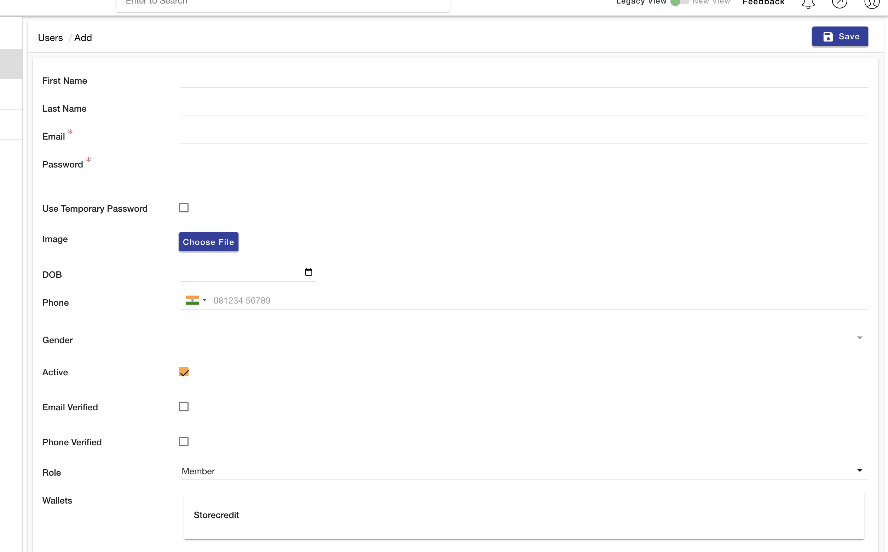

# Add User from Backend Users

## Add your first Users

go to  [users](https://mystore.in/admin/entity/ms.users/_add):

You will see something like this : 

Fill the necessary details and click submit 

[user_add]: ./img/users_add.png "Add User page"
