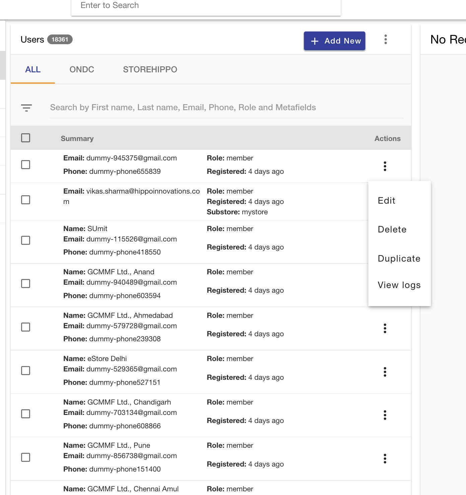

# Modify User data

## Edit User Details from Backend

go to  [users](https://mystore.in/admin/entity/ms.users/view?section=all):

Click on the three dots : 

click on edit and you can edit the neccasary details

[user_add]: ./img/users_add.png "Add User page"

## Delete User Details from Backend

After click the three dots as in the above image , click on delete
